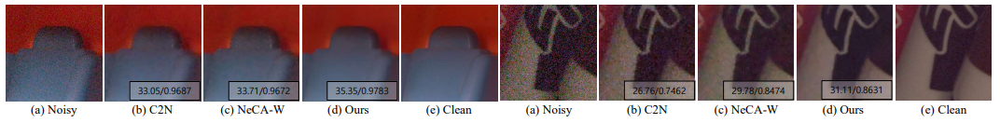

# sRGB Real Noise Modeling <br> via Noise-Aware Sampling with Normalizing Flows
Dongjin Kim*, Donggoo Jung*, Sungyong Baik, Tae Hyun Kim
<br>\*Equal Contribution

[[ICLR2024] Paper](https://openreview.net/forum?id=2XBBumBGeP)

| Camera / ISO    | Clean | Noisy | Sampled Noisy |
| :---: | :---:         | :---:            | :---:            |
| Samsung Galaxy S6 Edge / 03200 |  |  | <video src="https://github.com/dongjinkim9/NAFlow/assets/48521269/ce2c1ec3-cb52-40fa-8266-322768e171e4" /> |
| Google Pixel / 06400 |  |  | <video src="https://github.com/dongjinkim9/NAFlow/assets/48521269/edfbadad-ec24-4bd4-9b3c-7e00b221794e" /> |


## Table of Contents

- [Framework Overview](#framework-overview)
- [How to run](#how-to-run)
  - [Installation](#installation)
  - [Training and Evaluation](#training-and-evaluation)
- [Results](#results)
- [Citation](#citation)
- [Acknowledgement](#acknowledgement)


## Framework Overview

### Training
<p align="center">
  
</p>

### Inference
<p align="center">
  
</p>

## How to run

### Installation

```bash
# Clone this repo
git clone https://github.com/dongjinkim9/NAFlow.git
cd NAFlow

# Create and activate conda environment
conda env create -f environments.yaml
conda activate naflow
```


### Training and Evaluation

<table>
  <tr>
    <th align="left">Model</th>
    <th align="center">Training Instructions</th>
    <th align="center">Testing Instructions</th>
  </tr>
  <tr>
    <td align="left">NAFlow</td>
    <td align="center"><a href="naflow/README.md#Training">Link</a></td>
    <td align="center"><a href="naflow/README.md#Generation">Link</a></td>
  </tr>
  <tr>
    <td align="left">Denoising Networks</td>
    <td align="center"> - </td>
    <td align="center"><a href="denoising/README.md#evaluation">Link</a></td>
  </tr>
</table>

## Results

### NAFlow


### Denoising networks with NAFlow 


## Citation

If you find our work useful in your research, please consider citing our paper:

```bibtex
@article{kim2023srgb,
  title={sRGB Real Noise Modeling via Noise-Aware Sampling with Normalizing Flows},
  author={Kim, Dongjin and Jung, Donggoo and Baik, Sungyong and Kim, Tae Hyun},
  booktitle={ICLR},
  year={2023}
}
```

## Acknowledgement

The codes are based on [DeFlow](https://github.com/volflow/DeFlow). We thank the authors for sharing their codes.
